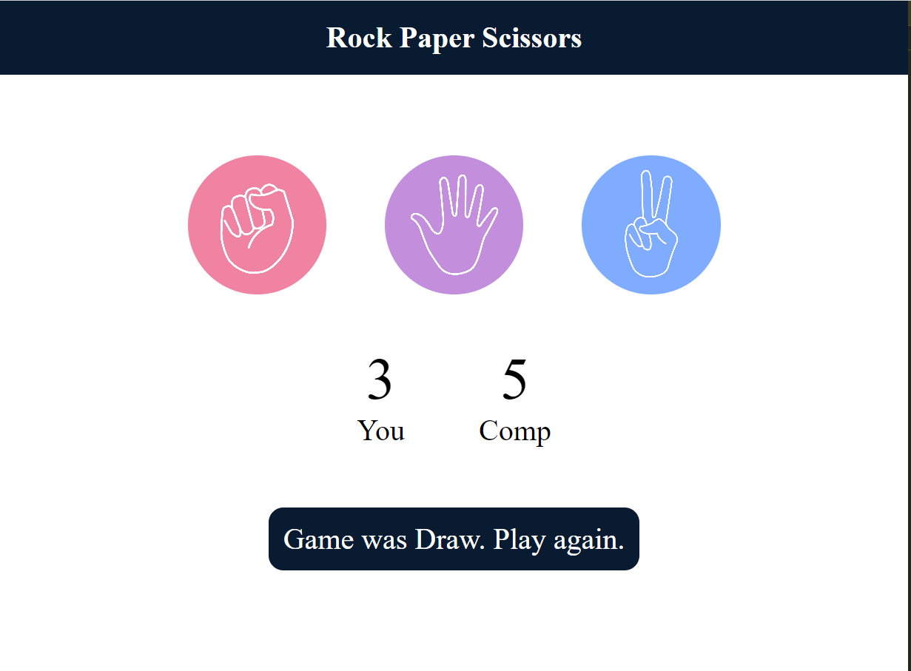

<h1>
Stone-Paper-Scissors
</h1>
 
<h4>
Game Between user and computer
</h4>
  
<h2>Project Overview</h2>
 

This mini project is a fun and interactive version of the popular game, built using HTML, CSS, and JavaScript. You can play the game by choosing between Rock, Paper, or Scissors, and the computer will randomly pick one of the three. The game will then determine the winner based on the traditional rules.

  
<h2>Features</h2>
User Interface: A simple and intuitive design that allows users to click on their choice (Rock, Paper, or Scissors).
Dynamic Score Update: The score is updated in real-time as the user plays the game.
Game Messages: The game provides feedback for each round, indicating whether the user won, lost, or tied with the computer.
Responsive Design: The game layout adjusts to different screen sizes.
  

<h2>Technologies</h2>
 
HTML: For the structure and layout of the game.
CSS: For styling and creating a visually appealing interface.
JavaScript: For game logic, handling user interaction, and determining the game’s outcome.
 

<h2>How to Play</h2>
 
<li>
<ol>Open the game in a web browser.</ol>
<ol>Choose either Rock, Paper, or Scissors by clicking the corresponding image.</ol>
<ol>The computer will randomly select its choice.</ol>
<ol>The game will compare the user's and the computer's choices and display the result:
<b>Rock beats Scissors</b>
<b>Scissors beat Paper</b>
<b>Paper beats Rock</b></ol>
</li>
The scores for both the user and the computer will be updated after each round.
  
<h2>Screenshots</h2>
Insert screenshots of the game interface here.
## Screenshots

*Game start screen*

*Winning screen with updated score*

*Draw screen with updated score*

* lossing screen with updated score*

  
<h2>Getting Started</h2>
To run this project locally:
 
Clone the repository:
<li>
<ul>git clone https://github.com/gsandhya-12/Stone-Paper-Scissors.git</ul>
<ul>Open the index.html file in your web browser.</ul>
</li>
  
<h2>Future Improvements</h2>
Add sound effects for each move.
Include a restart button to reset the game without refreshing the page.
Implement difficulty levels by tweaking the computer’s choice probability
